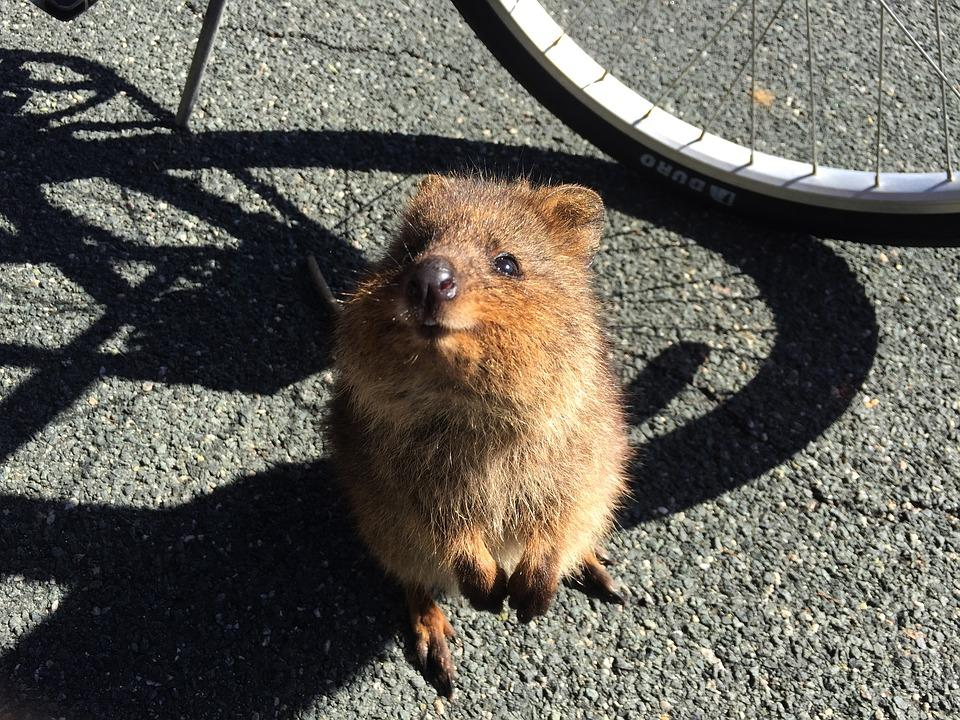

.. _h4953f701979187537264126f415951:

Fauna particolare
#################

Terrestre

\ |STYLE0|\  

\ |IMG1|\ 

Il \ |STYLE1|\  (\ |STYLE2|\ ) è un piccolo marsupiale dalle dimensioni di un grosso gatto, è erbivoro e generalmente notturno. 

.. admonition:: Curiosità

    Il quokka è l’animale più felice del mondo. 

.. bottom of content

.. |STYLE0| replace:: **Q u o k k a**

.. |STYLE1| replace:: **quokka**

.. |STYLE2| replace:: *Setonix brachyurus*

