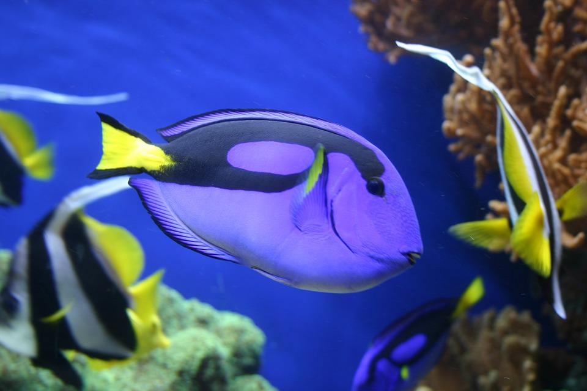
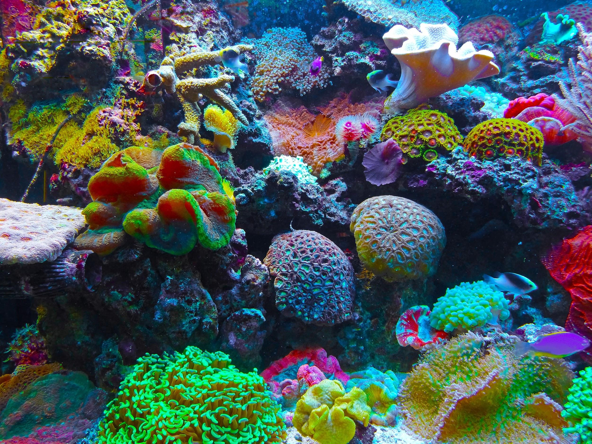
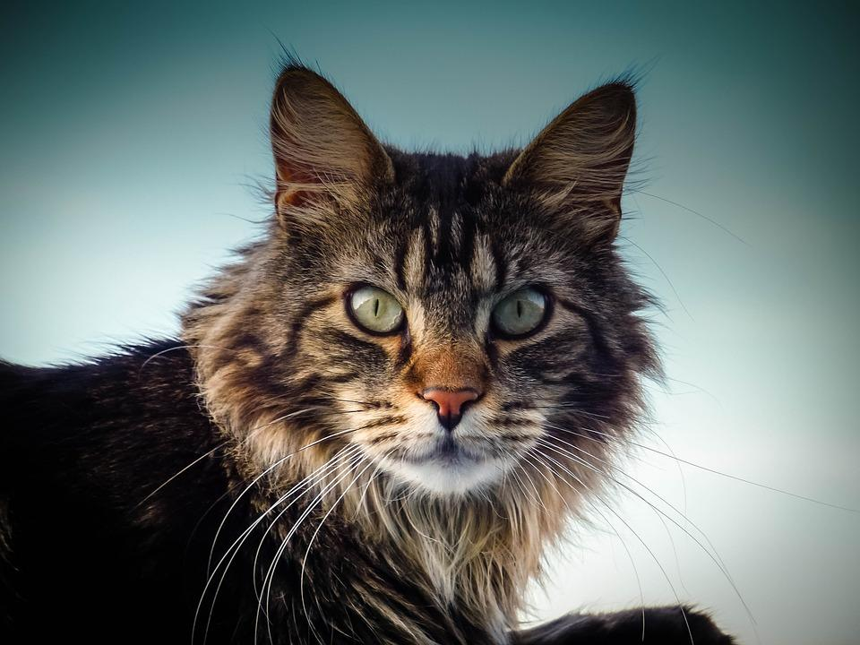
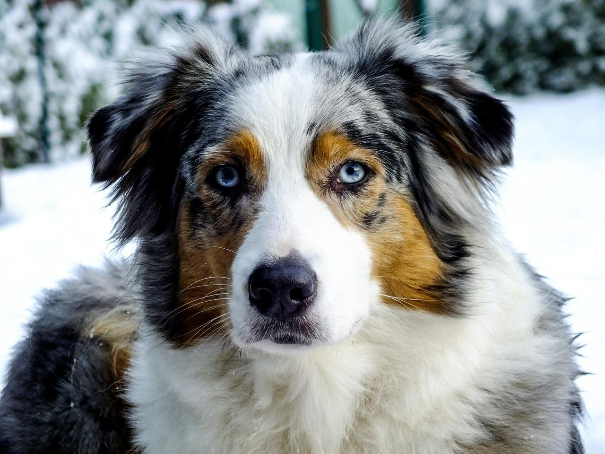
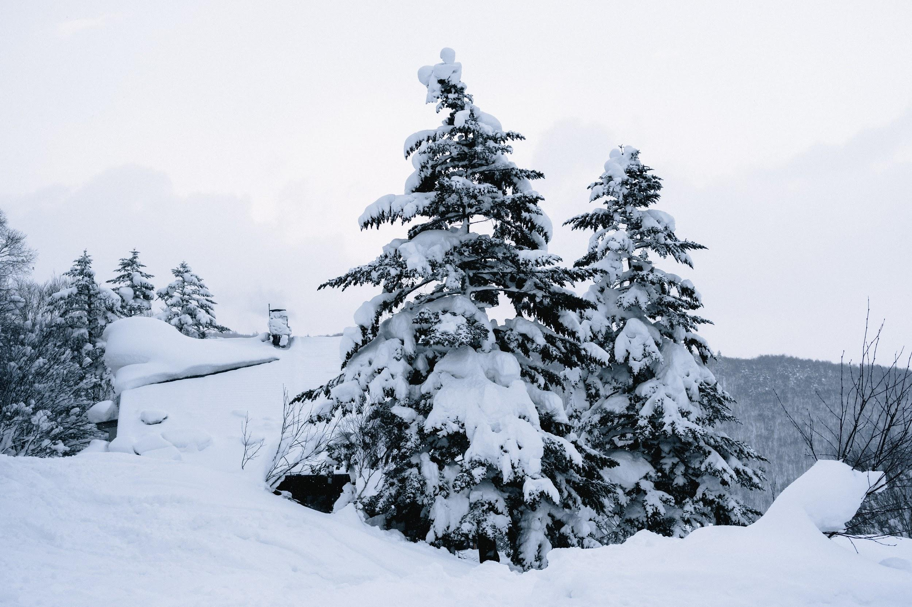

.. _h5528586b3f302562354635f12255c31:

Fauna/Flora
###########

.. _h7b5a6c645e1f411326292e95a484337:

Marina
******

\ |STYLE0|\ 

\ |IMG1|\ 

Con il termine \ |STYLE1|\ , dal latino \ |STYLE2|\ , si intende un gruppo eterogeneo di organismi vertebrati fondamentalmente acquatici, coperti di scaglie e dotati di pinne, che respirano attraverso le branchie. 

\ |STYLE3|\  

\ |IMG2|\ 

La \ |STYLE4|\  è una formazione tipica dei mari e oceani tropicali, composta da formazioni rocciose sottomarine biogeniche. 

.. admonition:: Curiosità

    La Grande Barriera Corallina si trova in Australia.

.. _h656a4968c776e7a4f72341f2032238:

Terrestre
*********

\ |STYLE5|\   

\ |IMG3|\ 

Il \ |STYLE6|\  è un gatto di origine nord americana (del Maine), è una razza naturale a pelo semilungo. il suo nome significa “procione del Maine”.

.. admonition:: Curiosità

    Il suo nome significa “procione del Maine”

\ |STYLE7|\  

\ |IMG4|\ 

.. admonition:: Curiosità

    razza canina statunitense

\ |STYLE8|\   

\ |IMG5|\ 

L’\ |STYLE9|\  (\ |STYLE10|\ ) è una pianta tipica delle foreste e delle montagne dell’emisfero boreale. 

.. admonition:: Curiosità

    Un albero sempreverde e monoico, cioè presenta una distinzione di fiori sia maschili sia femminili. 

.. bottom of content

.. |STYLE0| replace:: **P e s c i**

.. |STYLE1| replace:: **pesci**

.. |STYLE2| replace:: *pisces*

.. |STYLE3| replace:: **C o r a l l i**

.. |STYLE4| replace:: **barriera corallina**

.. |STYLE5| replace:: **F e l i n o   M a i n e   C o o n**

.. |STYLE6| replace:: **Maine Coon**

.. |STYLE7| replace:: **R a z z a   c a n i n a   P a s t o r e   A u s t r a l i a n o**

.. |STYLE8| replace:: **A b e t e   B i a n c o**

.. |STYLE9| replace:: **abete bianco**

.. |STYLE10| replace:: *Abies alba*

.. toctree::
:maxdepth: 3
:caption: Indice
fauna/flora
quokka
